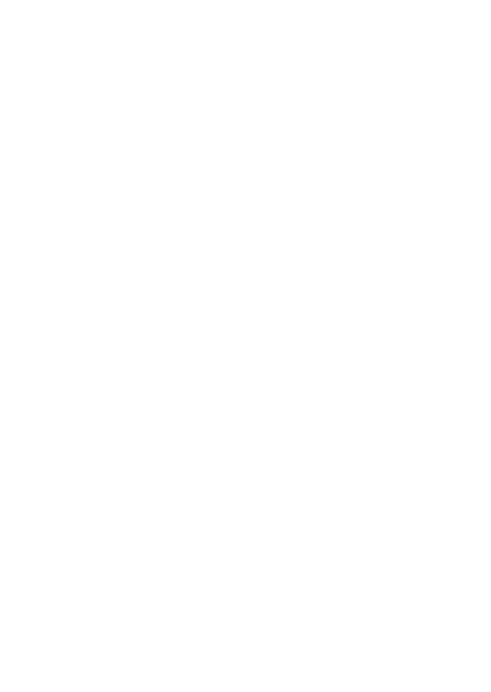
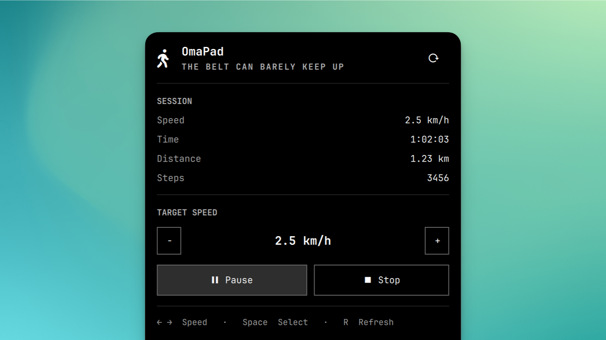

<p align="center">
  
</p>

<h1 align="center">OmaPad</h1>

<p align="center">A native Linux and Omarchy controller for WalkingPad treadmills.</p>

<p align="center">
  <a href="https://github.com/Aayush9029/OmaPad/releases/latest"></a>
  <a href="LICENSE"></a>
</p>

<p align="center">
  
</p>

## Install

OmaPad needs Linux, BlueZ, and systemd. The installer adds the Omarchy widget automatically when Omarchy is present.

```bash
curl -fsSL https://raw.githubusercontent.com/Aayush9029/OmaPad/main/install.sh | bash
```

## Use

```text
omapad                         Open the terminal dashboard
omapad status                  Show the current session
omapad start|pause|stop        Control the belt
omapad speed <0.5-6.0>         Set speed in km/h
omapad doctor                  Check the connection
```

OmaPad talks directly to the treadmill over Bluetooth. It uses a private Unix socket so the terminal and Omarchy widget can safely share one connection.

## Development

Run the protocol, IPC, daemon, and panel state tests without a treadmill or Bluetooth connection:

```bash
go test -race ./...
go vet ./...
node --test tests/*.test.cjs
```

The panel uses Omarchy's shared hero, separators, section headings, and buttons.
Its state formatting and speed-command rules live in `omarchy/local.omapad/Model.js`,
which the tests execute directly. To build locally, run `go build -o omapad .`.
